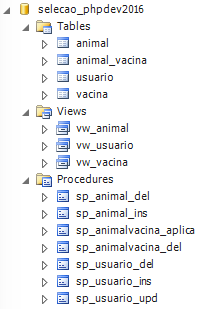

# Missão para Full Stack SimplesVet

## Sua missão, caso deseje aceitá-la:
A aplicação **SimplesVet Lite** está evoluindo e precisa de 3 novas funcionalidades:

1. O animal está sem proprietário... =(  Crie um cadastro para `Proprietários`  com `Nome`, `email` e `telefone`; Depois atualize a tela de `Animais` para que ela receba o `Proprietário`
2. O campo de raça, no cadastro de animal é um texto... pode isso, Arnaldo? Legal seria se tivesse uma tabela e no cadastro de animal fosse um ComboBox, Select ou algo similar com as raças cadastradas.
3. Os animais precisam ser vacinados!! Crie um lugar onde seja possível aplicar uma vacina para o animal (já tem tabela! Veja na sessão [*estrutura de dados*](#estrutura)).

## Alguns erros foram reportados pela equipe de Customer Success
1. O peso não está gravando corretamente as casas decimais
2. Não está sendo possível atualizar um animal! O.O

## Go further!
Se quiser ir **além** e mostrar que *Tom Cruise* é licuri, aqui vão algumas coisas divertidas:

1. A aplicação e a API estão sem controle de acesso... o.O 
2. Seria legal ter upload da imagem do animal!

Fique livre para propor/implementar outras novidades bacanas. Seja de funcionalidade ou estrutura de código.

## Como entregar

1. Faça um clone desse repositório
2. Faça as funcionalidades propostas no seu repositório com seus devidos commits.
3. Publique a aplicação rodando em algum servidor seu ou um free, como o [Heroku](https://www.heroku.com/). Pode ser qualquer um...
4. Responda o email que você recebeu o convite para esse desafio com o link do seu repositório e da aplicação rodando. Informe um login e senha no email, caso tenha implementado a parte de segurança.

## AWS mode on! (Se quiser ir além)

1. Ta afim de se destacar? Crie uma conta na [AWS (é free por 1 ano)](https://aws.amazon.com/pt/free/) e crie toda infra pra aplicação lá...
2. O ideal é que as imagens não fiquem no servidor de aplicação, então as imagens dos animais devem ir para um bucket no `AWS S3`. =)

----
### Estrutura de dados
Para acelerar e te dar uma idéia do padrão que usamos, já entregamos uma estrutura básica de banco com tabelas, views e procedures:

### Estrutura da Aplicação
Separamos em 2 pastas: `api` e `app`. Na pasta `app` Existe uma aplicação em PHP sem uso de nenhum framework, apenas uma lib criada por nós chamada `Genesis`. Na `api`, usamos o Slim Framework para criar os endpoints e o `Genesis` para acesso ao banco e algumas funções.

### Setup
Para saber como colocar a aplicação pra funcionar, acesse o arquivo [SETUP.md](SETUP.md)

### Template
Para interface do exemplo, foi usado o template [Metronic](http://keenthemes.com/preview/metronic/theme/admin_3/). Acesse o link para visualizar todos os recursos disponíveis no template.

### Acessar a Aplicação
Acesse em http://localhost/selecao-fullstack2018/app/ (Claro que isso vai depender do seu ambiente local)

---

Essa mensagem se autodestruirá em 5, 4, 3, 2, 1....

